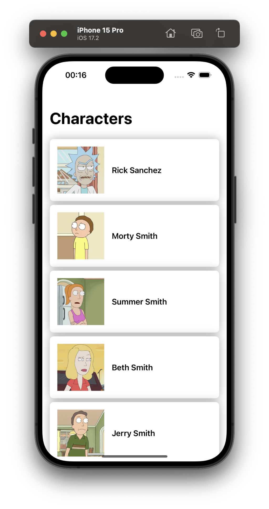
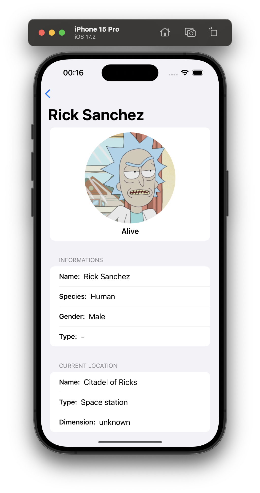

# Rick&Morty

Sample app written using SwiftUI to fetch content from [Rick&Morty API](https://rickandmortyapi.com/documentation).

## Screenshots




## Prerequisites

There are some prerequisites needed to build the app.

They are:

- Ruby
- Bundler
- fastlane

### Ruby

If you use macOS, system Ruby is not recommended. [There are a variety of ways to install Ruby without having to modify your system environment](https://www.ruby-lang.org/en/documentation/installation/#managers). For macOS and Linux, [asdf-vm](https://asdf-vm.com/) is a good Ruby environment manager.

### Using [Bundler](https://bundler.io/)

Provides a consistent environment when using Ruby dependencies.

```sh
gem install bundler
```

### Using [fastlane](https://fastlane.tools/)

The easiest way to build and release mobile apps.

```sh
bundle install
```

## Possible improvements

- [ ] Do not use ```AsyncImage```, as it cancels some requests (create your own solution or use a third-party library)
- [ ] Improve accessibility
- [ ] Add UI Tests
- [ ] Make Strings localized
- [ ] Use another architecture more compatible with declarative languages (Composable or Redux)
